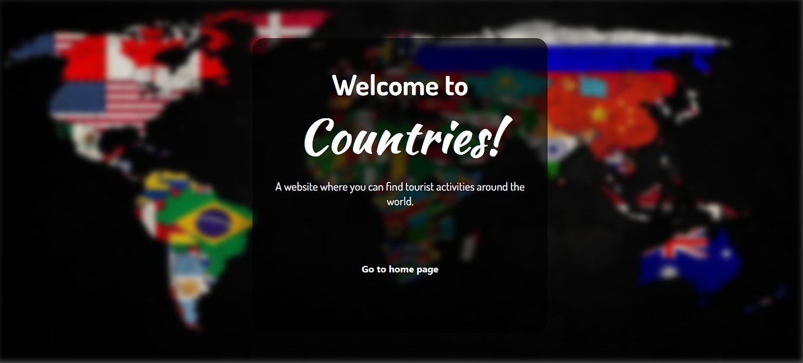
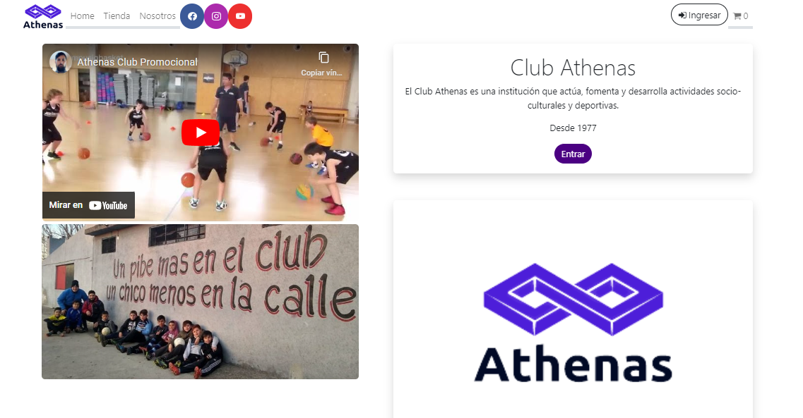

  

# 🛠 Habilidades técnicas:

  
  
  
  
  
  
  
  
  
  
  
  

 

# 📚 Proyectos:

  ## Countries!
  

    
  

  

    Una App para buscar actividades turísticas alrededor del mundo.
    Probá creando la tuya propia 😁  
    <a href='https://countriesaroundtheworld.netlify.app/'>Link</a>
  

  ## Athenas Club
  

    
  

  

    App administrativa para un club deportivo. 
    <a href='https://github.com/MATarg81/proyecto-final'>Link</a>
  

# 📎 Contactame:

  Estoy en LinkedIn:  
  

  O escribime:  
    
   lausofimarce@gmail.com

<!--
**Azrux/Azrux** is a ✨ _special_ ✨ repository because its `README.md` (this file) appears on your GitHub profile.

Here are some ideas to get you started:

- 🔭 I’m currently working on ...
- 🌱 I’m currently learning ...
- 👯 I’m looking to collaborate on ...
- 🤔 I’m looking for help with ...
- 💬 Ask me about ...
- 📫 How to reach me: ...
- 😄 Pronouns: ...
- ⚡ Fun fact: ...
-->
